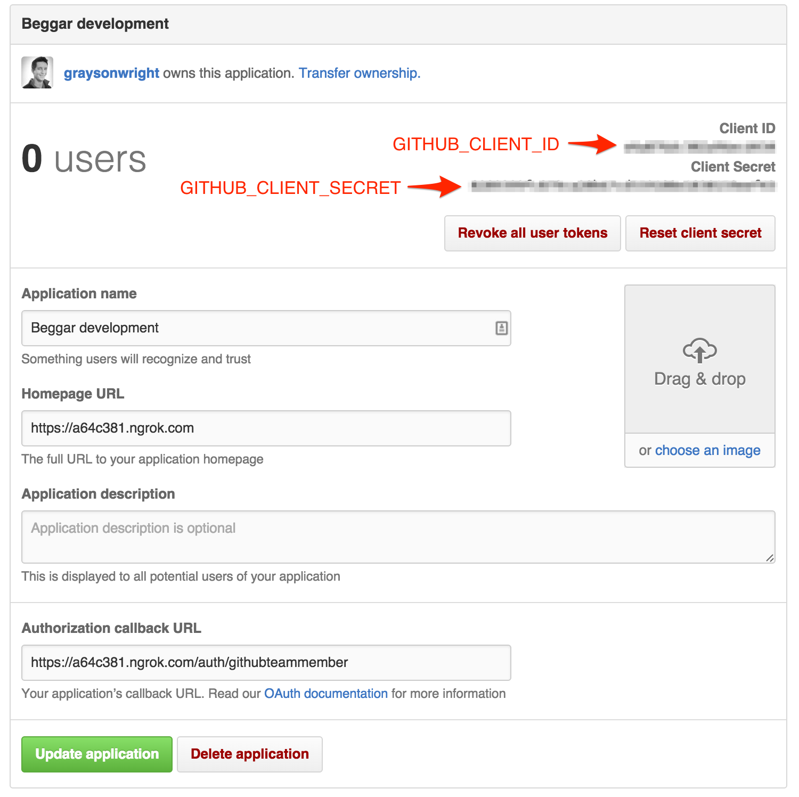

# Beggar

### What is beggar?

Beggar is a tool to help with getting pull request reviews. Once you have set up
Beggar on your repo, new pull requests will be posted to Beggar according to
their tags. These tags will also be used to determine which Slack room Beggar
will post to.

If the PR does not have a "Sign off" of "LGTM", it will be reposted to the same
rooms again after 30 minutes.

To make sure your PR goes to the correct place, your PR description should
include tags like `#rails #javascript #design`. Beggar will parse and send to
all the appropriate rooms!

Beggar also provides a web interface that allows you to view open PRs for your
group and filter them by tag. This makes it very easy to grab a pull request in
your downtime for whatever tag you prefer.

### Authentication

Beggar uses GitHub teams for controlling access to the web interface. When
setting up the app, you should set the `GITHUB_TEAM_ID` environment variable to
the team id that will have access.

There is no User model and users are not tracked in anyway.

### Local Development

After you have cloned this repo, run this setup script to set up your machine
with the necessary dependencies to run and test this app:

    % ./bin/setup

It assumes you have a machine equipped with Ruby, Postgres, etc. If not, set up
your machine with [this script].

[this script]: https://github.com/thoughtbot/laptop

After setting up, you can run the application using [foreman]:

    % foreman start

If you don't have `foreman`, see [Foreman's install instructions][foreman]. It
is [purposefully excluded from the project's `Gemfile`][exclude].

[foreman]: https://github.com/ddollar/foreman
[exclude]: https://github.com/ddollar/foreman/pull/437#issuecomment-41110407

### Configure Beggar on your local development environment

After cloning the repository, run the setup script

./bin/setup

Sign up for a free ngrok account and create a ~/.ngrok file with the following:

auth_token: <your-token>

Launch ngrok with a custom subdomain on port 5000.

ngrok -subdomain=<your-initials>-beggar 5000

Log into your GitHub account and go to your application settings.

Under the Developer applications panel - Click on "Register new application" and fill in the details:

Application Name: Beggar Development
Homepage URL: https://<your-initials>-beggar.ngrok.com
Authorization Callback URL: http://<your-initials>-beggar.ngrok.com/auth/githubteammember
On the confirmation screen, copy the Client ID and Client Secret to GITHUB_CLIENT_ID and GITHUB_CLIENT_SECRET in the .env file.

Run `foreman start`. Foreman will start the web server and the resque background job queue.
NOTE: rails server will not load the appropriate environment variables
and you'll get a "Missing secret_key_base for 'development' environment" error.

### Guidelines

Use the following guides for getting things done, programming well, and
programming in style.

* [Protocol](http://github.com/thoughtbot/guides/blob/master/protocol)
* [Best Practices](http://github.com/thoughtbot/guides/blob/master/best-practices)

## License

Beggar is Copyright (c) 2015 thoughtbot, inc.
It is free software, and may be redistributed
under the terms specified in the [LICENSE] file.

  [LICENSE]: /LICENSE [Style](http://github.com/thoughtbot/guides/blob/master/style)

## Contributing

See the [CONTRIBUTING] document.
Thank you, [contributors]!

  [CONTRIBUTING]: CONTRIBUTING.md
  [contributors]: https://github.com/thoughtbot/beggar/graphs/contributors

=======

## About

Beggar is maintained by [Jason Draper], [Christian Reuter], and [Melissa Xie].

  [Jason Draper]: http://github.com/drapergeek
  [Christian Reuter]: http://github.com/creuter
  [Melissa Xie]: https://github.com/mxie

Beggar is maintained and funded by thoughtbot, inc.
The names and logos for thoughtbot are trademarks of thoughtbot, inc.

We love open source software!
See [our other projects][community]
or [hire us][hire] to help build your product.

  [community]: https://thoughtbot.com/community?utm_source=github
  [hire]: https://thoughtbot.com/hire-us?utm_source=github
